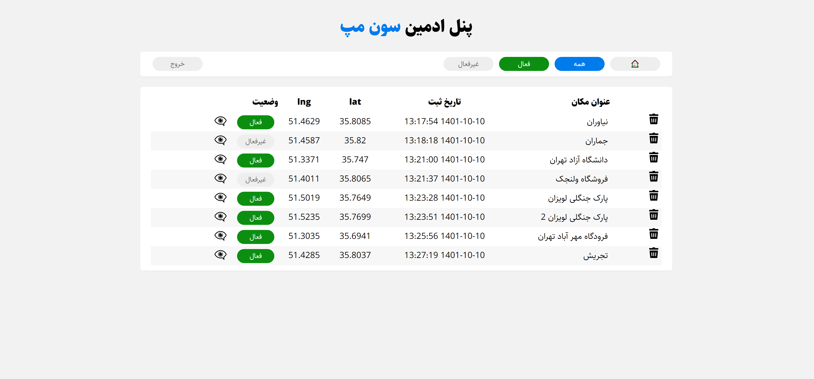

# 7Map

## Setup

Create .env file in root path like .env.example file

## Built with

- Pure PHP (PHP 8)
- MySQL
- SQL
- PDO Database Connection
- HTML 5
- CSS 3
- JQuery 3.6.3
- Ajax
- Leaflet 1.6.0

## Features
- Add new location by anyone
- Search verified locations
- Geolocation
- Access admin panel in yourdomain.com/admin.php
- Confirm locations by admin
- Keep admin login by session and cookie
- BCRYPT algorithm to store admin password
- Admin logout
- Filter location by status
- Delete location in admin panel
- Change location status in admin panel
- Display user location
- Display all locations information in admin panel
- Display location by iframe in admin panel

## Screenshots

### Map

### Admin
